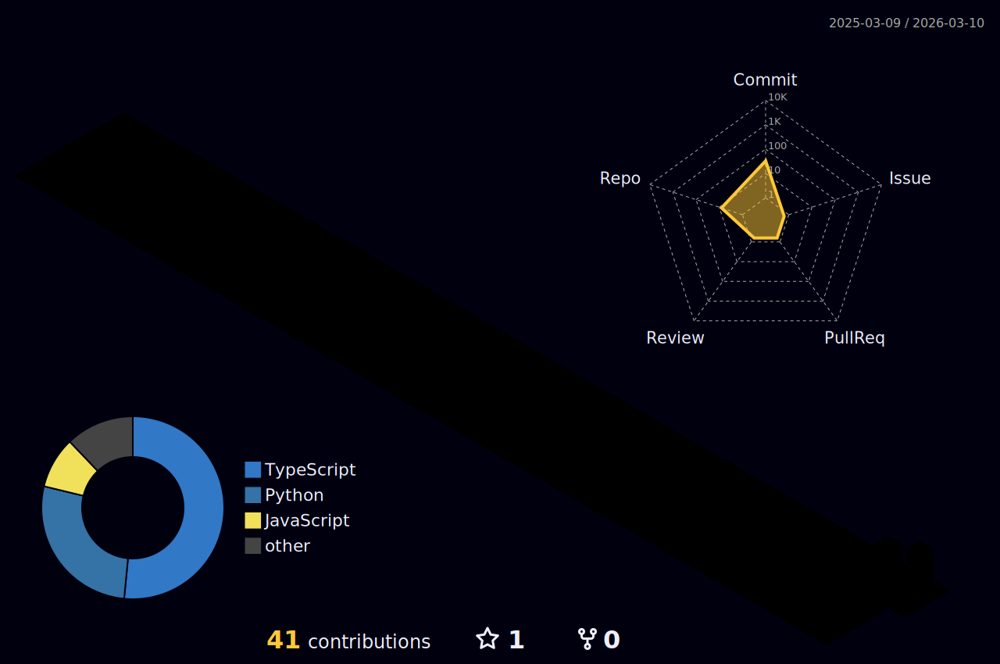

<!-- ============================================================ -->
<!--                    HEADER — Waving Gradient                  -->
<!-- ============================================================ -->

<!-- ============================================================ -->
<!--                     NEON SIGN ANIMATION                      -->
<!-- ============================================================ -->

  

<!-- ============================================================ -->
<!--                        ABOUT ME                              -->
<!-- ============================================================ -->

## &nbsp; About Me

  

 

- **🔭 Building** &nbsp; [gen-diag.com](https://gen-diag.com) — AI-powered "Buzz Diagnosis" platform that generates personalized diagnostic content with LLMs
- **📦 Published** &nbsp; [zero-config-cli-bridge](https://www.npmjs.com/package/zero-config-cli-bridge) — Zero-setup MCP middleware that exposes local CLIs as AI agent tools
- **🧪 Exploring** &nbsp; AI agent architectures, MCP protocol & prompt engineering
- **☁️ GCP Enthusiast** &nbsp; Vertex AI · Cloud Run · Firebase — building scalable AI services on Google Cloud
- **🧠 Philosophy** &nbsp; Ship fast, iterate faster. Let AI handle the boring parts.

 

<!-- ============================================================ -->
<!--                      CONNECT                                 -->
<!-- ============================================================ -->

  
  &nbsp;
  
  &nbsp;
  

 

<!-- ============================================================ -->
<!--                    MATRIX RAIN DIVIDER                       -->
<!-- ============================================================ -->

 

<!-- ============================================================ -->
<!--                       TECH STACK                             -->
<!-- ============================================================ -->

## &nbsp; Tech Stack

#### &nbsp; Languages

  

#### &nbsp; Frontend

  

#### &nbsp; Backend & Cloud

  

#### &nbsp; Tools & DevOps

 

<!-- ============================================================ -->
<!--                     GITHUB ANALYTICS                         -->
<!-- ============================================================ -->

## &nbsp; GitHub Analytics

  
  &nbsp;&nbsp;
  

 

  

 

 

<!-- ============================================================ -->
<!--                        TROPHIES                              -->
<!-- ============================================================ -->

  

 

<!-- ============================================================ -->
<!--                    FEATURED PROJECTS                         -->
<!-- ============================================================ -->

## &nbsp; Featured Projects

&nbsp;&nbsp;

 

<!-- ============================================================ -->
<!--                   SNAKE ANIMATION                            -->
<!-- ============================================================ -->

## &nbsp; Contribution Snake

<picture>
  <source media="(prefers-color-scheme: dark)" srcset="https://raw.githubusercontent.com/hatyibei/hatyibei/output/github-snake-dark.svg" />
  <source media="(prefers-color-scheme: light)" srcset="https://raw.githubusercontent.com/hatyibei/hatyibei/output/github-snake.svg" />
  
</picture>

 

<!-- ============================================================ -->
<!--                3D CONTRIBUTION CHART                         -->
<!-- ============================================================ -->

## &nbsp; 3D Contributions

 

<!-- ============================================================ -->
<!--                      DEV QUOTE                               -->
<!-- ============================================================ -->

  

 

<!-- ============================================================ -->
<!--                    FOOTER — Waving Gradient                  -->
<!-- ============================================================ -->

  

